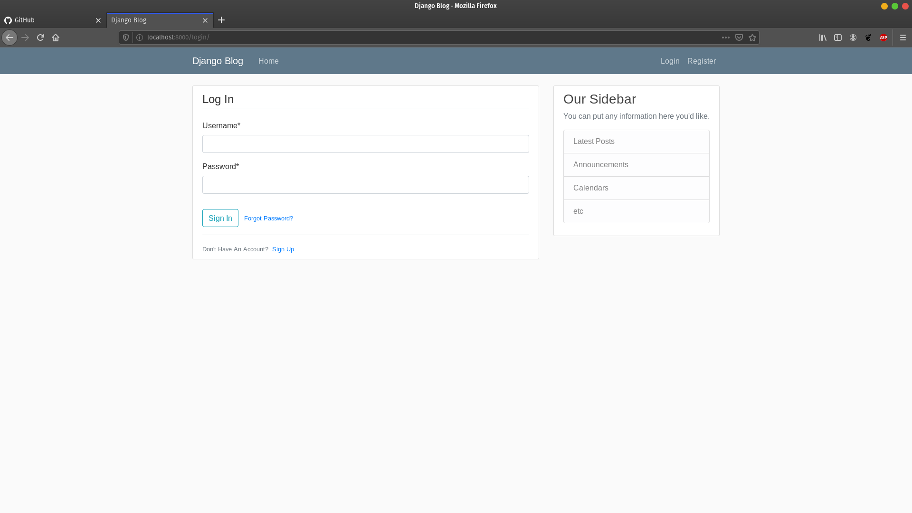
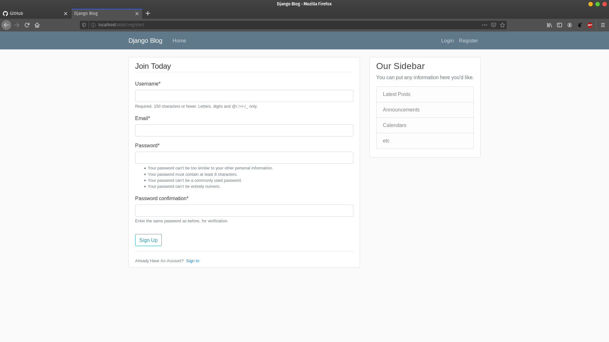
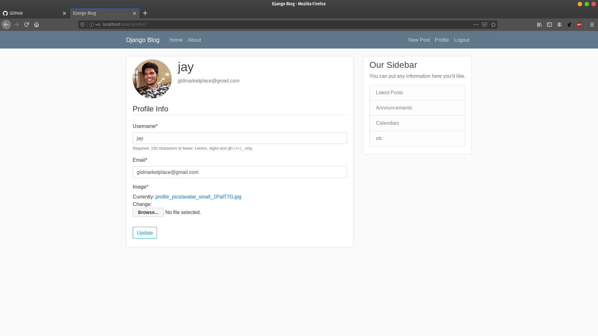
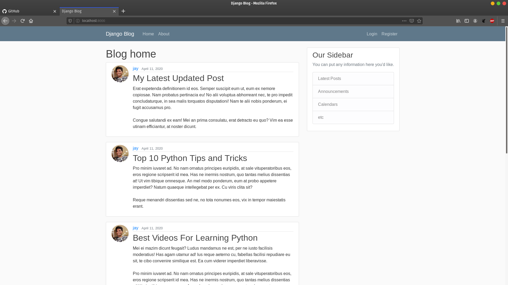
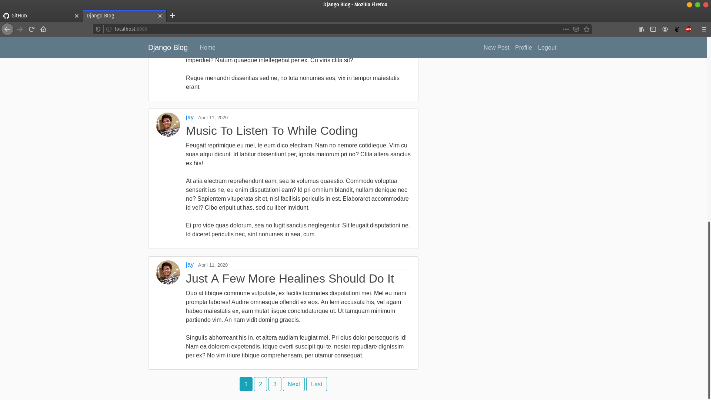
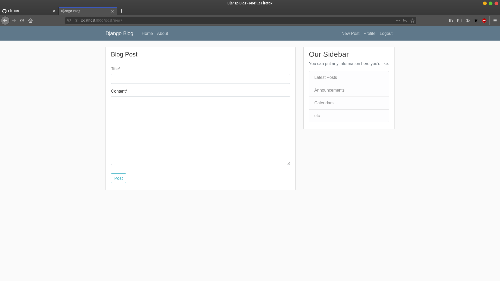
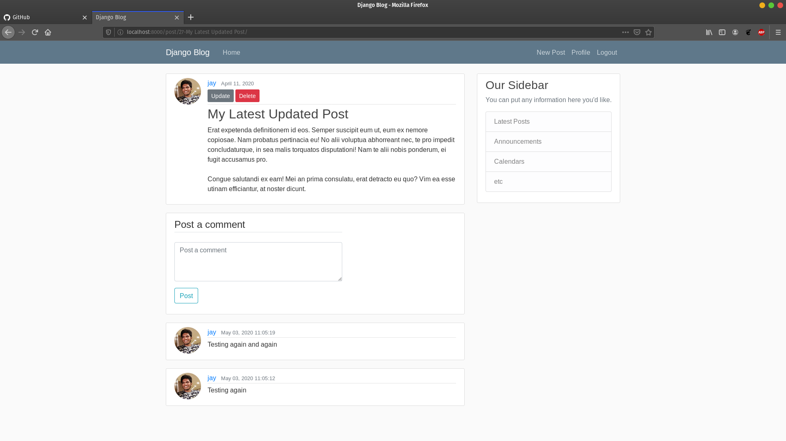

# SimpleBlog - A Django based Blog/CMS web application

It's pretty basic, includes the following features:

1. Authentication system (Login, Registration & Reset Password via email, Set SMTP details in settings.py to send reset pass emails).
2. User profile, an editable username, avatar for every user.
3. Blog home, Lists posts made by all the users with pagination.
4. Every user can create a new post, update & delete their own posts.
5. Every post can have comments, Haven't implemented pagination for this.

Setup:

1. Clone the repo, type in the following command in the root dir:

   source env/bin/activate

2. Change the working directory to src and run:

   python manage.py runserver

this runs the django's dev webserver on your machine and you can access the web app from the displayed url in your browser.

Screenshots:

